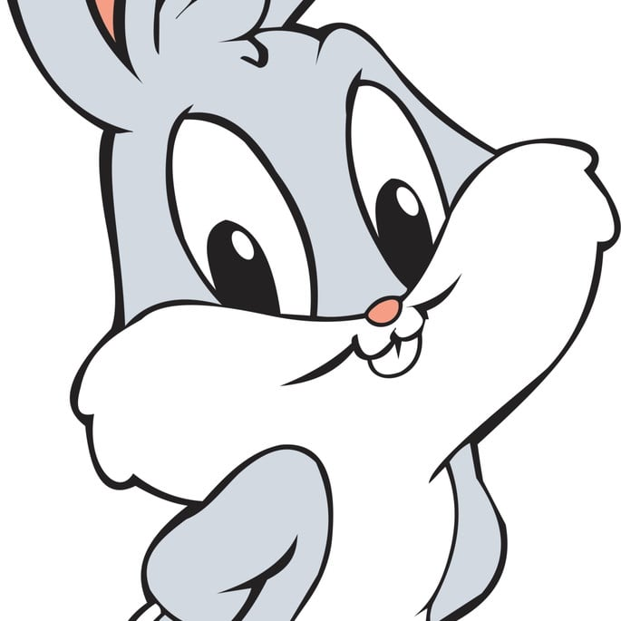
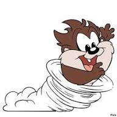
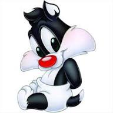
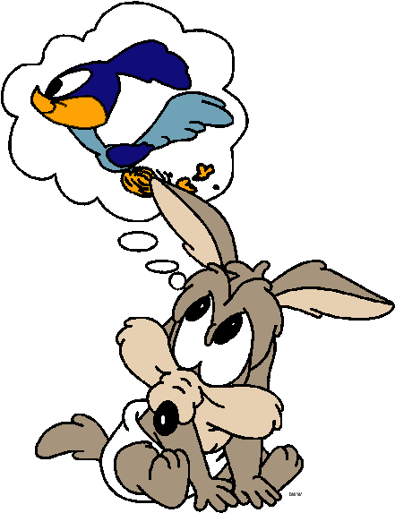

<h1>Desafio de projeto do Felipão: Pernalonga Kart.JS</h1>

<table>
  <tr>
    <td>
      
    </td>
    <td>
      <b>Objetivo:</b>
      
Pernalonga é uma simulação de corrida inspirada em jogos de corrida. Nosso desafio será criar uma lógica de um jogo de vídeo game para simular corridas, levando em consideração as regras e mecânicas abaixo.

    </td>
  </tr>
</table>

<h2>Players</h2>
<table style="border-collapse: collapse; width: 800px; margin: 0 auto;">
  <tr>
    <td style="border: 1px solid black; text-align: center;">
      
Pernalonga

      
    </td>
    <td style="border: 1px solid black; text-align: center;">
      
Velocidade: 4

      
Manobrabilidade: 3

      
Poder: 3

    </td>

    <td style="border: 1px solid black; text-align: center;">
      
Piu-Piu

      
    </td>
    <td style="border: 1px solid black; text-align: center;">
      
Velocidade: 3

      
Manobrabilidade: 4

      
Poder: 2

    </td>

    <td style="border: 1px solid black; text-align: center;">
      
Patolino

      
    </td>
    <td style="border: 1px solid black; text-align: center;">
      
Velocidade: 2

      
Manobrabilidade: 4

      
Poder: 3

    </td>
  </tr>

  <tr>
    <td style="border: 1px solid black; text-align: center;">
      
Taz

      
    </td>
    <td style="border: 1px solid black; text-align: center;">
      
Velocidade: 5

      
Manobrabilidade: 2

      
Poder: 5

    </td>

    <td style="border: 1px solid black; text-align: center;">
      
Frajola

      
    </td>
    <td style="border: 1px solid black; text-align: center;">
      
Velocidade: 3

      
Manobrabilidade: 4

      
Poder: 4

    </td>

    <td style="border: 1px solid black; text-align: center;">
      
Coyote

      
    </td>
    <td style="border: 1px solid black; text-align: center;">
      
Velocidade: 2

      
Manobrabilidade: 2

      
Poder: 5

    </td>
  </tr>
</table>

<h3>🕹️ Regras & mecânicas:</h3>

<b>Jogadores:</b>

<input type="checkbox" />
<label>O Computador deve receber dois personagens para disputar a corrida em um objeto cada</label>

<b>Pistas:</b>

<ul>
  <li><input type="checkbox" /> Os personagens irão correr em uma pista aleatória de 5 rodadas</li>
  <li><input type="checkbox" /> A cada rodada, será sorteado um bloco da pista que pode ser uma reta, curva ou confronto
    <ul>
      <li><input type="checkbox" /> RETA → dado + VELOCIDADE</li>
      <li><input type="checkbox" /> CURVA → dado + MANOBRABILIDADE</li>
      <li><input type="checkbox" /> CONFRONTO → dado + PODER (perdedor perde ponto)</li>
      <li><input type="checkbox" /> Nenhum jogador pode ter pontuação negativa</li>
    </ul>
  </li>
</ul>

<b>Condição de vitória:</b>

<input type="checkbox" />
<label>Ao final, vence quem acumulou mais pontos</label>